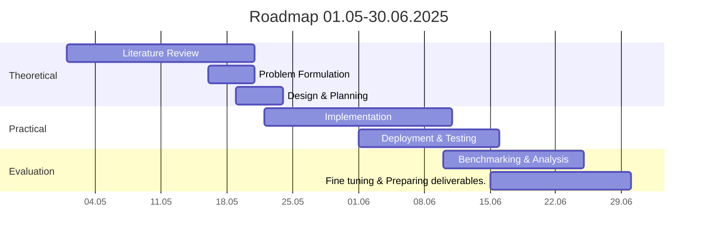

---
tags:
  - oranisation
---

# Bachelor-Projekt Cyber-Physical Systems Roadmap
## Blockchain Consensus for Dynamic Robot Swarm Networks
##### Donatien Leray

\
&#8203;
### Abstract
Existing blockchain consensus protocols in swarm robotics select block producers without considering how well-connected a node is or how much relevant information it holds. This can lead to inefficient decision-making, especially in dynamic and partitioned networks where some nodes have limited connectivity and outdated information.
The goal of this project is to design a new consensus protocol to accelerate block production when connectivity is high, thus reducing consensus latency and ultimately improving information flow and responsiveness in robotic swarms.
\
\
&#8203;

|Phase | Start - End // *Days* | Notes|
|---|---|---|
|Literature Review | 01.05 - 21.05 // *20* | Focused, goal-driven reading. Review related work in consensus methods and network dynamics from both the blockchain and robotics perspective.|
|Problem Formulation | 16.05 - 21.05 // *5*| Define assumptions, metrics, objectives.|
|Design & Planning| 19.05 - 24.05 // 5|Architecture of the system, choosing consensus model(s), design of swarm logic.|
|Implementation | 22.05 - 11.06 // *20* | Actual coding phase.|
|Deployment & Testing | 01.06 - 16.06 // *15* | Set up dynamic scenarios (mobility, failure, delays). Validate the proposed solution.|
|Benchmarking & Analysis | 10.06 - 25.06 // *15*|  Run simulations to obtain metrics such as costs in terms of latency and bandwidth. Assess the scalability, adaptability and robustness of the method.|
|Fine tuning & Preparing deliverables | 15.06 - 30.06 // *15* |Refine simulation parameters for consistency and fairness across consensus models. Ensure results are comparable by aligning test conditions. Polish and clean up codebase. Prepare figures, charts for the final report/thesis |
